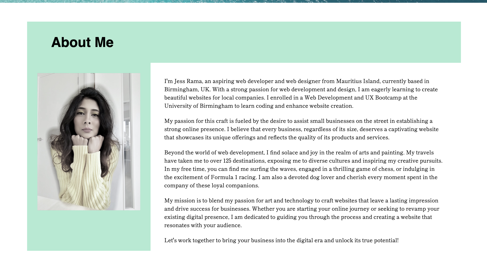
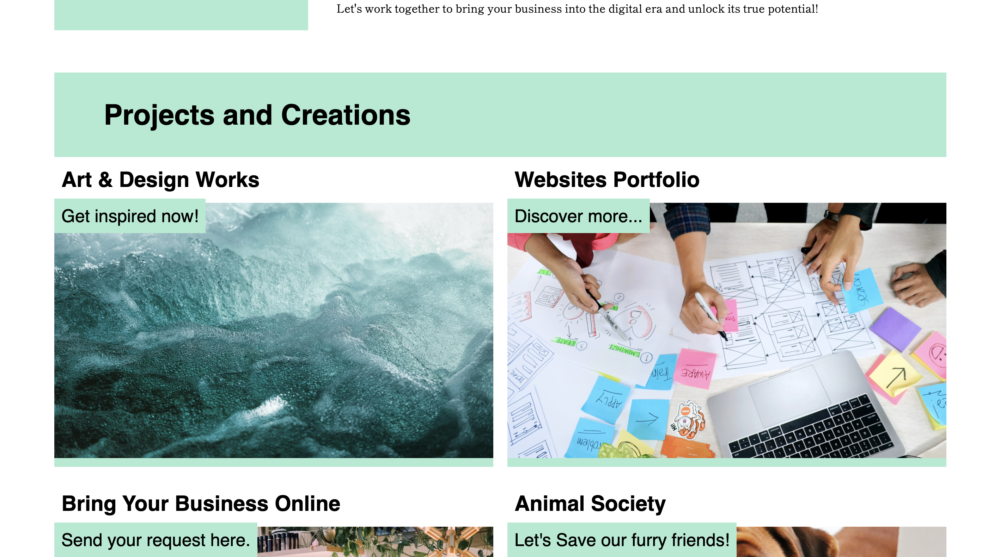
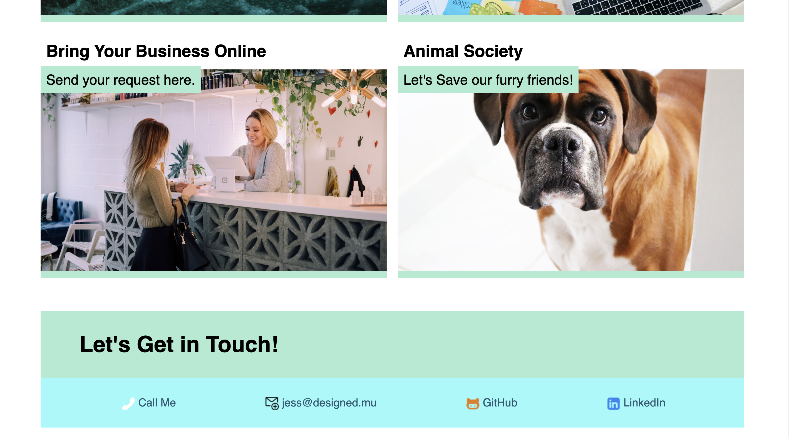
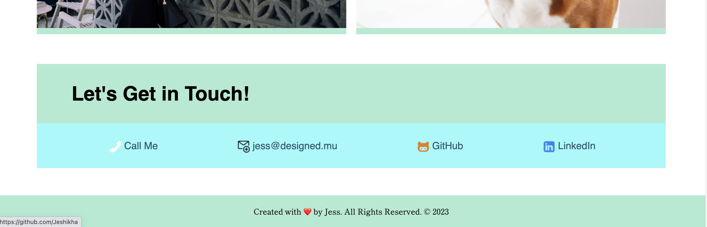

# My Portfolio Page

## Reason of this Project

The purpose of this project is to build a portfolio page to showcase the skills I have learnt in this last 2 weeks as an aspiring web developer. As said by our tutors, having a portfolio is crucial when searching for job opportunities as it allows potential employers to see the projects I have worked on and understand my thought process behind them. By creating a portfolio with deployed web applications, I aim to practice more into creating good user interface websites and increase my chances of success in the job search after completing the boot camp. I am really grateful to be part of such a course and I still cannot believe the progress I made from the last 2 weeks when I knew nothing about coding and getting a web page functional. This project has allowed me to apply the core skills I've learned, such as flexbox, grids, media queries, and CSS variables, in a real-world context.

## Project Overview
This project is a portfolio page that displays my name as 'Digital Artisan Jess', a recent photo of me, and links to different sections about me, my future works and creations, and contact information. The portfolio is designed to be visually appealing and user-friendly. It helped me use the core skills that I have learnt on HTML and CSS so far, such as flexbox, media queries, and CSS variables to ensure a responsive layout that adapts to various screen sizes and devices.

## Page Section
1. Profile name, Navigation bar and Hero Banner

Upon loading the page, the user is presented with my profile name, a hero banner with a big display image in the background, and navigation links to different sections of the page.

2. Navigation with Smooth Scrolling

When the user clicks on any navigation link, the UI smoothly scrolls to the corresponding section on the page.

3. Highlighting First Application Image Text

The first application's image text in the "Hero Banner" section is larger in size compared to others, drawing attention to it so that when you click iy, you can visit my GitHub profile repsitories.

4. About me section
Displays a profile picture of me and a biography of my motivations and goals for this course.

5. Work/Creation Section with Titled Images

The "Work" or "Creation" section displays titled images of my applications in a grid area.

6. Application Links

Clicking on the images of my applications redirects the user to my GitHub pages as I do not have a web page for my potfolio yet. My Contact me links will redirect you to my GitHub profile and LinkedIn profile.

7. Responsive Layout

The portfolio page's layout is responsive and adapts seamlessly to different viewport sizes and devices as I have set the parameters in my CSS file for Media Screen sizes.

8. Contact Me 

I have added my phone, email, GitHub and LinkedIn profile in the "Let's Get In Touch" section with functional redirections.

## Goals
As the course progresses and I create more web applications, I will replace the images and names with real applications to further enhance the portfolio's credibility and impact.

By building this portfolio page, I am setting myself up for future success in my career search, ensuring I have a strong online presence that showcases my web development skills and projects. The portfolio will evolve and grow as I continue to practice and develop new applications, and I look forward to the opportunities it will bring in my journey as an aspiring web developer.

## Tools and Resources Used
• Google Fonts: 
Custom fonts from Google Fonts have been integrated into the project to enhance typography and visual appeal.

• Unsplash: 
High-quality stock images from Unsplash have been used to create visually engaging content on the portfolio page.

• Coolors.co: 
The color palette for this project was selected using Coolors.co, ensuring a harmonious and cohesive visual experience.

• Streamline Icons: 
Icons for the navigation bar and Let's Get in Touch sections has been sourced from Streamline Icons, providing a professional touch to the design.

• Mentor Support: 
Drew and classmates have provided invaluable assistance throughout the project, offering guidance and clearing doubts whenever needed.

 • GitHub Repository: 
 This project's source code and related files are hosted on GitHub in a public repository. GitHub serves me as a version control system, allowing me to track changes made to the codebase, collaborate with others, and manage the development of the project. 

 • VS Code: 
 Throughout the development process, VS Code proved to be an invaluable code editor. 

 # Struggles and Dedication
During the development of this portfolio page, I encountered challenges, particularly with grid area layout. I have googled to assist me with difficulties I faced when some styles did not go right. I have dedicated approximately 15 to 17 hours to fine-tuning the layout and ensuring a seamless user experience. Despite the challenges, I am proud of the final outcome and the valuable skills I gained throughout the project.

# License
This project is licensed under the MIT License.

### Screenshots of Page Layout
The following images shows the web application's appearance and functionality:

## Useful Links to facilitate viewing of project

1. The URL of the GitHub repository:
https://github.com/Jeshikha/my-portfolio

2. The URL of the functional, deployed application on GitHub Pages:

